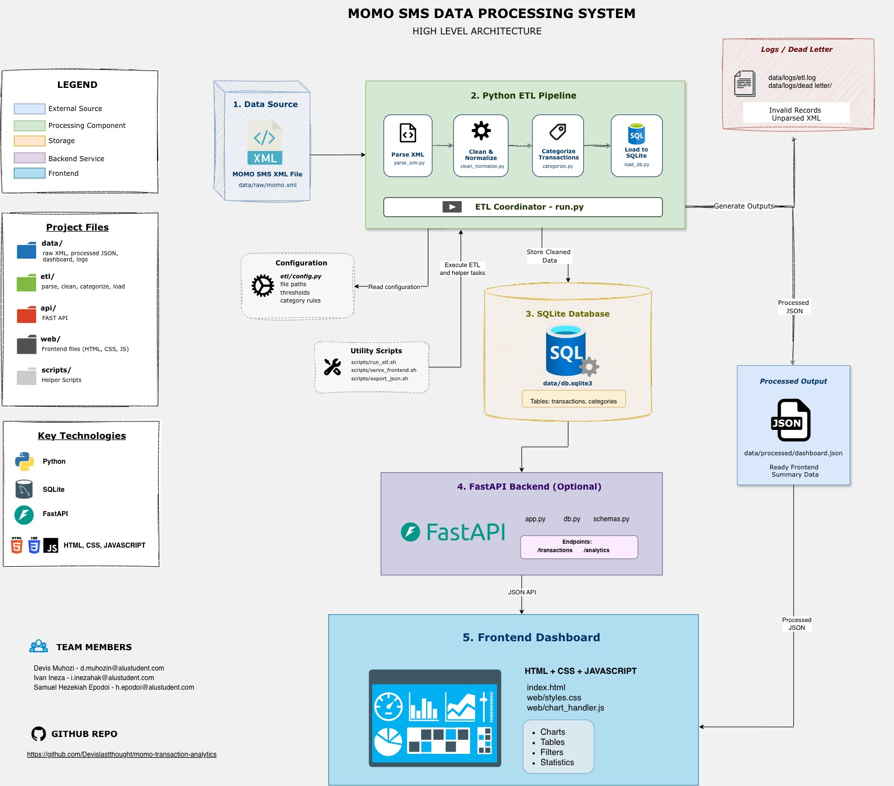

# EWD Group Work

## Project Description
This project processes MoMo (Mobile Money) SMS transaction data provided in XML format.
The pipeline parses, cleans, and categorizes the raw SMS data, stores it in a relational
(SQLite) database, and exposes it through a frontend dashboard for analysis and
visualization (transaction volumes, amounts, and categories over time).

## Current Progress
This is our Week 1 project setup. We have added the folder structure, team details,
architecture diagram, and Scrum board. The ETL pipeline, dashboard, optional API,
and tests are still to be implemented.

## Team Members
- Ivan Ineza Hakizimana — @Ivan70807 — Backend/ETL
- Samuel Hezekiah Epodoi — @sam-hez — Frontend
- Devis Muhozi — @Devislastthought — Database/API

## System Architecture
Draw.io High level architecture diagram design: (https://viewer.diagrams.net/?tags=%7B%7D&lightbox=1&highlight=0000ff&edit=_blank&layers=1&nav=1&title=Momo%20Transactions%20Architecture.drawio&dark=auto#Uhttps%3A%2F%2Fdrive.google.com%2Fuc%3Fid%3D1fWVONddyhtNbjNPeAsJQeziU1_lwqy-9%26export%3Ddownload)
A copy of the diagram is included below.



## Scrum Board (Trello)
Track our progress here: https://trello.com/b/ne4syt27

## Project Structure
```
.
├── README.md                         # Setup, run, overview
├── .env.example                      # DATABASE_URL or path to SQLite
├── requirements.txt                  # Dependencies will be added during development
├── docs/
│   └── momo-architecture-diagram.jpg   # High-level system design
├── index.html                        # Dashboard entry (static)
├── web/
│   ├── styles.css                    # Dashboard styling
│   ├── chart_handler.js              # Fetch + render charts/tables
│   └── assets/                       # Images/icons (optional)
├── data/
│   ├── raw/                          # Provided XML input (git-ignored)
│   ├── processed/
│   │   └── dashboard.json            # Placeholder until the ETL export is ready
│   ├── db.sqlite3                    # Generated later by the ETL pipeline
│   └── logs/
│       ├── etl.log                   # Generated later during processing
│       └── dead_letter/              # Unparsed/ignored XML snippets
├── etl/
│   ├── config.py                     # File paths, thresholds, categories
│   ├── parse_xml.py                  # XML parsing (ElementTree/lxml)
│   ├── clean_normalize.py            # Amounts, dates, phone normalization
│   ├── categorize.py                 # Simple rules for transaction types
│   ├── load_db.py                    # Create tables + upsert to SQLite
│   └── run.py                        # CLI: parse -> clean -> categorize -> load -> export JSON
├── api/                              # Optional (bonus)
│   ├── app.py                        # Minimal FastAPI with /transactions, /analytics
│   ├── db.py                         # SQLite connection helpers
│   └── schemas.py                    # Pydantic response models
├── scripts/
│   ├── run_etl.sh
│   ├── export_json.sh
│   └── serve_frontend.sh
└── tests/
    ├── test_parse_xml.py
    ├── test_clean_normalize.py
    └── test_categorize.py
```

## Setup

Clone the repository and create a virtual environment:
```bash
git clone https://github.com/Devislastthought/momo-transaction-analytics.git
cd momo-transaction-analytics
python3 -m venv venv
source venv/bin/activate
```

`requirements.txt` is a placeholder for now. We will add dependencies when we
start implementing the pipeline. `.env.example` contains a proposed database
path; the application does not read it yet.

When we start processing data, place the provided `momo.xml` in `data/raw/`.
Raw XML, the generated database, and logs are ignored by Git. The `.gitkeep`
files keep the empty folders in the repository.

## Planned Run Steps

The scripts and application files are placeholders, so these commands will only
be useful after implementation:

```bash
pip install -r requirements.txt
cp .env.example .env
bash scripts/run_etl.sh
bash scripts/serve_frontend.sh
```

The planned frontend address is http://localhost:8000. The optional FastAPI
backend will be added later, with its run instructions once it is ready.

## Dashboard Data

`data/processed/dashboard.json` contains a valid JSON placeholder, not processed
MoMo data. `status` is set to `not_processed`, `transactions` is empty, and
`summary` is empty because no totals have been calculated yet. We will update
this format when we implement the dashboard and ETL export.

## Testing

The files in `tests/` are placeholders and do not contain tests yet. We will add
tests for XML parsing, cleaning, and categorization during development.
