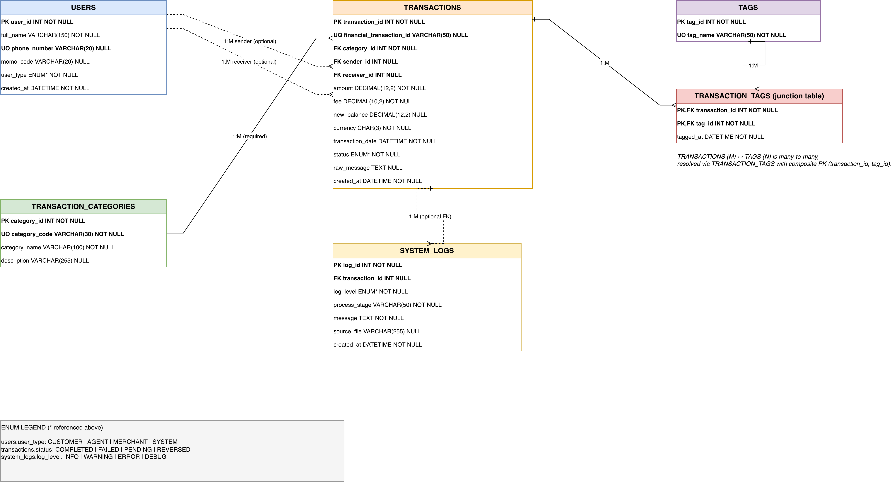

# MoMo Transaction Analytics

Enterprise Web Development group project for processing and analysing MoMo SMS
transactions supplied in XML format.

## Database Design Document (PDF)

**[Database Design Document PDF](https://drive.google.com/file/d/1iSFLY2MmDlJPP_yQQ37MpRMbfuDzILU9/view?usp=sharing)**

The PDF contains the database design documentation for the Week 2 submission.

## Current progress (Week 2)

The repository contains the database ERD, SQL setup and sample data, SQL tests,
recorded test results, and JSON examples. The setup uses MySQL style SQL and was
tested on **MariaDB 10.4.27 through XAMPP**. A run on Oracle MySQL has not been
recorded here; the assignment's MySQL requirement still needs confirmation.

Week 1 proposed SQLite for the application. Week 2 adds the SQL database design
required by the assignment. The ETL pipeline, API, dashboard and Python tests
remain placeholders. The SQL setup inserts sample records; it does not import XML.

## Team and project links

- Ivan Ineza Hakizimana — @Ivan70807 — Backend/ETL; Week 2 JSON examples
- Samuel Hezekiah Epodoi — @sam-hez — Frontend; Week 2 SQL testing and integration
- Devis Muhozi — @Devislastthought — Database/API; Week 2 schema and ERD

Team Participation Sheet (https://docs.google.com/spreadsheets/d/1GonHvdL1HM06K-z2PElY-2wRZhfMsZfxQQ4Bfkp_DD0/edit?usp=sharing)

Trello Board (https://trello.com/b/ne4syt27)

[Database Design Document (PDF)](docs/MoMo%20Database%20Design%20Document.pdf)

## Database design

The six tables are `users`, `transaction_categories`, `transactions`, `tags`,
`transaction_tags`, and `system_logs`. Transactions reference a category and
optional sender/receiver users. The junction table `transaction_tags` connects
transactions and tags through a composite primary key. A log can reference a
transaction or have a NULL reference when no transaction record exists.

The SQL includes foreign keys, unique transaction references, nonnegative amount
and fee checks, and indexes for transaction lookups. See the
[design rationale](docs/ERD_explanation.md) and
[editable ERD](docs/erd_diagram.drawio).



## Files

```text
database/
  database_setup.sql          Tables, constraints, indexes and sample inserts
  test_queries.sql            Counts, queries, CRUD and rollback checks
  constraint_tests.sql        Deliberately invalid operations
examples/
  json_schemas.json           Examples for all six tables and a nested transaction
  transaction_full.json       Nested transaction example
  user.json                   User example
  transaction_category.json   Category example
  system_log.json             Processing log example
  README.md                   SQL-to-JSON mapping and omissions
docs/
  MoMo Database Design Document.pdf  Database design report
  erd_diagram.drawio          Editable ERD
  erd_diagram.png             Exported ERD
  ERD_explanation.md          Design rationale
  test-results/              Recorded MariaDB execution transcripts
  momo-architecture-diagram.jpg
```

The existing `etl/`, `api/`, `web/`, `scripts/`, and `tests/` folders hold the
application scaffold. `data/processed/dashboard.json` is an unprocessed placeholder.

## Run the database

Run commands from the repository root. Use a disposable database:
**`database_setup.sql` deletes and recreates `momo_sms_db`.** Back up any existing
work in that database before running it.

With a MySQL client and a running server:

```bash
mysql -u root -p --table --verbose
```

On the macOS XAMPP installation used for the recorded results, start the database
service in XAMPP Manager and use its bundled client:

```bash
/Applications/XAMPP/xamppfiles/bin/mysql -u root -p --table --verbose
```

Enter the password at the prompt. Inside the database client:

```sql
SELECT VERSION(), @@version_comment;
SOURCE database/database_setup.sql;
SOURCE database/test_queries.sql;
```

Stop and investigate any setup or normal-test errors. No Python dependencies are
needed to run these SQL files.

## Tests and results

The normal test file demonstrates transaction details, category totals, CREATE,
UPDATE, DELETE, and foreign-key delete behavior. Its test changes are rolled back;
auto-increment IDs may still have gaps.

For the negative tests, run each block in `database/constraint_tests.sql` in the
same connection, including its `ROLLBACK` after the expected error. The seven cases
are negative amount, negative fee, duplicate financial reference, invalid category,
duplicate junction pair, deletion of a referenced category, and NULL amount.
A rejected operation is expected in this file; it is not expected during setup.

Recorded results are in [docs/test-results](docs/test-results/):

- Six users, eight categories, six transactions, five tags, five tag links and five logs.
- Total amount: **71,600 RWF**; total fees: **200 RWF**.
- Zero leftover CRUD test rows and seven expected constraint errors.

These transcripts record MariaDB execution. They do not establish execution on
Oracle MySQL. They also do not replace the screenshots specifically requested for
the final design PDF.

## JSON examples

See [examples/json_schemas.json](examples/json_schemas.json) and the
[mapping notes](examples/README.md). The file contains example data rather than
formal JSON Schema definitions. The nested example follows transaction 1 in the
seed data, including its NULL receiver. Insertion-time timestamps are omitted;
transaction dates do not claim a timezone absent from the source SQL.

## XML input and future work

Keep the supplied dataset locally at `data/raw/momo.xml`; raw XML is ignored by Git.
Copying it there does not import it. XML parsing, database loading, API endpoints,
and dashboard visualisations remain future implementation work.

## Week 1 architecture

[DRAW.IO DIAGRAM LINK](https://viewer.diagrams.net/?tags=%7B%7D&lightbox=1&highlight=0000ff&edit=_blank&layers=1&nav=1&title=Momo%20Transactions%20Architecture.drawio&dark=auto#Uhttps%3A%2F%2Fdrive.google.com%2Fuc%3Fid%3D1fWVONddyhtNbjNPeAsJQeziU1_lwqy-9%26export%3Ddownload)


