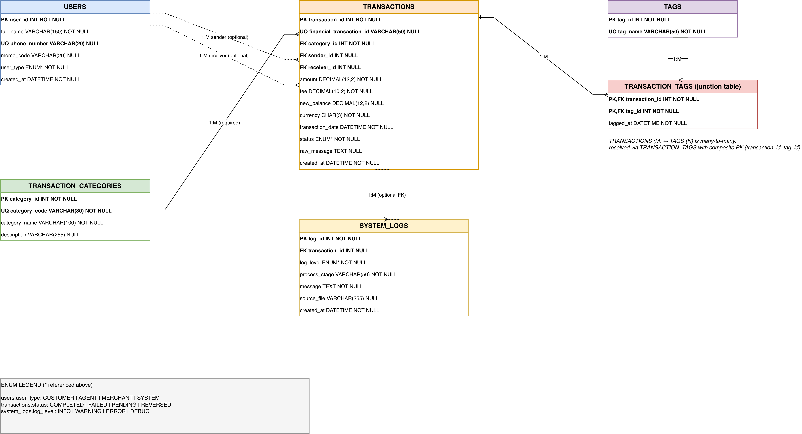
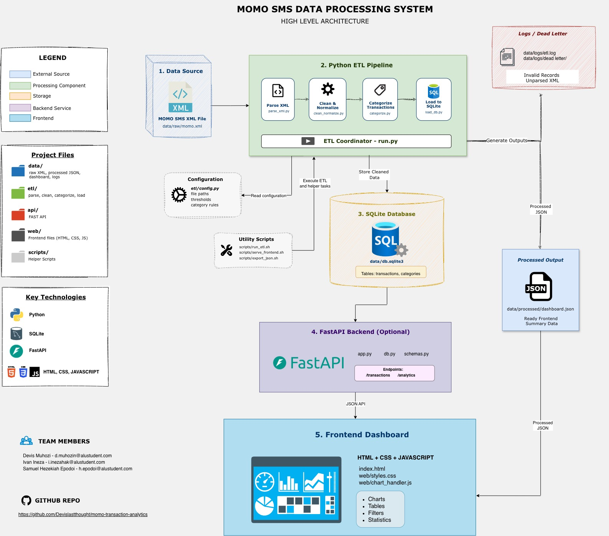

# MoMo Transaction Analytics

**Team name: Triple Threat**

Enterprise Web Development group project for processing and analysing MoMo SMS transactions supplied in XML format.

## Database Design Document (PDF)

**[Database Design Document PDF](https://drive.google.com/file/d/1iSFLY2MmDlJPP_yQQ37MpRMbfuDzILU9/view?usp=sharing)**

The PDF contains the database design documentation for the Week 2 submission.

## Current progress (Weeks 2 and 3)

The repository contains the database ERD, SQL setup and sample data, SQL tests, recorded test results, and JSON examples. The setup uses MySQL style SQL and was tested on **MariaDB 10.4.27 through XAMPP**. A run on Oracle MySQL has not been recorded here; the assignment's MySQL requirement still needs confirmation.

Week 1 proposed SQLite for the application. Week 2 adds the SQL database design required by the assignment. Week 3 adds a secured REST API and search benchmark (see [REST API](#rest-api-week-3)). The ETL pipeline and dashboard remain placeholders. The SQL setup inserts sample records; it does not import XML.

## Team and project links

* Ivan Ineza Hakizimana — @Ivan70807 — Backend/ETL; Week 2 JSON examples
* Samuel Hezekiah Epodoi — @sam-hez — Frontend; Week 2 SQL testing and integration
* Devis Muhozi — @Devislastthought — Database/API; Week 2 schema and ERD

Team Participation Sheet (https://docs.google.com/spreadsheets/d/1GonHvdL1HM06K-z2PElY-2wRZhfMsZfxQQ4Bfkp_DD0/edit?usp=sharing)

Team participation Sheet for Week 3 (https://docs.google.com/spreadsheets/d/1VHi_E-Z44u94SFLJpcACQITCTdPzp0qP7PHlWHSoczg/edit?usp=sharing)

Trello Board (https://trello.com/b/ne4syt27)

[Database Design Document (PDF)](docs/MoMo%20Database%20Design%20Document.pdf)

## Database design

The six tables are `users`, `transaction_categories`, `transactions`, `tags`, `transaction_tags`, and `system_logs`. Transactions reference a category and optional sender/receiver users. The junction table `transaction_tags` connects transactions and tags through a composite primary key. A log can reference a transaction or have a NULL reference when no transaction record exists.

The SQL includes foreign keys, unique transaction references, nonnegative amount and fee checks, indexes for transaction lookups, and a `COMMENT` on every table and column (view them with `SHOW FULL COLUMNS FROM transactions;`). See the [design rationale](docs/ERD_explanation.md) and [editable ERD](docs/erd_diagram.drawio).



## Files

```text
.gitignore                    Keeps secrets, caches and generated files out of Git
api/
  server.py                   Week 3 REST API (http.server + Basic Auth)
dsa/
  parse_xml.py                XML -> list of transaction dictionaries
  search_compare.py           Linear vs dictionary vs binary search benchmark
tests/
  test_api.py, test_dsa.py    Unit tests (12 tests)
  curl_tests.sh               End-to-end curl walkthrough of the API
screenshots/                  Test-case screenshots required by Week 3
database/
  database_setup.sql          Tables, constraints, indexes, column comments and sample inserts
  test_queries.sql            Counts, queries, CRUD and rollback checks
  constraint_tests.sql        Deliberately invalid operations
examples/
  json_schemas.json           Examples for all six tables and a nested transaction
  transaction_full.json       Nested transaction example
  user.json                   User example
  transaction_category.json   Category example
  system_log.json              Processing log example
  README.md                   SQL-to-JSON mapping and omissions
docs/
  MoMo Database Design Document.pdf  Database design report
  erd_diagram.drawio          Editable ERD
  erd_diagram.png             Exported ERD
  ERD_explanation.md           Design rationale
  test-results/               Recorded MariaDB execution transcripts
  momo-architecture-diagram.jpg
```

The existing `etl/`, `api/`, `web/`, `scripts/`, and `tests/` folders hold the application scaffold. `data/processed/dashboard.json` is an unprocessed placeholder. Week 3 adds `api/server.py`, `dsa/`, `tests/test_api.py`, `tests/test_dsa.py`, `tests/curl_tests.sh`, `docs/api_docs.md` and `screenshots/`.

## Run the database

Run commands from the repository root. Use a disposable database: **`database_setup.sql` deletes and recreates `momo_sms_db`.** Back up any existing work in that database before running it.

With a MySQL client and a running server:

```bash
mysql -u root -p --table --verbose
```

On the macOS XAMPP installation used for the recorded results, start the database service in XAMPP Manager and use its bundled client:

```bash
/Applications/XAMPP/xamppfiles/bin/mysql -u root -p --table --verbose
```

Enter the password at the prompt. Inside the database client:

```sql
SELECT VERSION(), @@version_comment;
SOURCE database/database_setup.sql;
SOURCE database/test_queries.sql;
```

Stop and investigate any setup or normal-test errors. No Python dependencies are needed to run these SQL files.

## Tests and results

The normal test file demonstrates transaction details, category totals, CREATE, UPDATE, DELETE, and foreign-key delete behavior. Its test changes are rolled back; auto-increment IDs may still have gaps.

For the negative tests, run each block in `database/constraint_tests.sql` in the same connection, including its `ROLLBACK` after the expected error. The seven cases are negative amount, negative fee, duplicate financial reference, invalid category, duplicate junction pair, deletion of a referenced category, and NULL amount. A rejected operation is expected in this file; it is not expected during setup.

Recorded results are in [docs/test-results](docs/test-results/):

* Six users, eight categories, six transactions, five tags, five tag links and five logs.
* Total amount: **71,600 RWF**; total fees: **200 RWF**.
* Zero leftover CRUD test rows and seven expected constraint errors.

These transcripts record MariaDB execution. They do not establish execution on Oracle MySQL. They also do not replace the screenshots specifically requested for the final design PDF.

## JSON examples

See [examples/json_schemas.json](examples/json_schemas.json) and the [mapping notes](examples/README.md). The file contains example data rather than formal JSON Schema definitions. The nested example follows transaction 1 in the seed data, including its NULL receiver. Insertion-time timestamps are omitted; transaction dates do not claim a timezone absent from the source SQL.

## REST API (Week 3)

A REST API for the MoMo SMS records, written in plain Python (`http.server`) with no third-party packages. It parses `modified_sms_v2.xml` into JSON transactions, serves them through CRUD endpoints protected with HTTP Basic Authentication, and compares linear search with dictionary lookup.

```text
data/raw/modified_sms_v2.xml
        |
        v
dsa/parse_xml.py  ->  list of transaction dicts
        |
        v
api/server.py  ->  in-memory dict {id: transaction}  ->  JSON over HTTP
        ^
        |
  Basic Auth check on every request
```

The API keeps its data in memory and reloads the XML on restart. It is separate from the MySQL design above; connecting the two is future work.

### Run it

Requires Python 3.8 or newer. Run from the repository root.

```bash
export API_USER=your_username
export API_PASSWORD=choose_a_strong_password
python3 api/server.py
```

The server starts on `http://127.0.0.1:8000` and refuses to start if `API_USER` or `API_PASSWORD` is missing. Optional: `API_HOST`, `API_PORT`, `MOMO_XML_PATH` (see `.env.example`). In a second terminal, export the same two variables and try:

```bash
curl -u "$API_USER:$API_PASSWORD" http://127.0.0.1:8000/transactions/1
curl -u "$API_USER:wrong-password" http://127.0.0.1:8000/transactions
```

### Endpoints

| Method | Path                 | Description                    | Success | Errors        |
| ------ | -------------------- | ------------------------------ | ------- | ------------- |
| GET    | `/transactions`      | List all transactions          | 200     | 401           |
| GET    | `/transactions/{id}` | Get one transaction            | 200     | 401, 404      |
| POST   | `/transactions`      | Create a transaction           | 201     | 400, 401      |
| PUT    | `/transactions/{id}` | Update fields of a transaction | 200     | 400, 401, 404 |
| DELETE | `/transactions/{id}` | Delete a transaction           | 200     | 401, 404      |

Requests, responses and error codes: [docs/api_docs.md](docs/api_docs.md).

### Security

* Basic Auth is checked before any route runs; failures return `401` with `WWW-Authenticate`.
* The password is compared in constant time (`hmac.compare_digest`).
* Credentials come from environment variables, never from the source code.
* POST and PUT bodies are validated (JSON shape, required fields and no `null` in them, types, non-negative amount, timestamp format, unknown fields) and limited to 1 MB.
* Basic Auth only Base64-encodes credentials, so it needs HTTPS in real use. JWT and OAuth 2.0 are stronger; the report compares them.

### Search benchmark

Average time per lookup by id, in microseconds (`python3 dsa/search_compare.py`):

| Records | Linear  | Dictionary | Binary |
| ------- | ------- | ---------- | ------ |
| 20      | 0.312   | 0.052      | 0.550  |
| 100     | 0.818   | 0.045      | 0.407  |
| 1,691   | 15.706  | 0.045      | 0.955  |
| 10,000  | 87.597  | 0.116      | 1.277  |
| 100,000 | 844.423 | 0.253      | 2.495  |

Linear search is O(n), binary search O(log n), dictionary lookup O(1) on average. Timings vary by machine. The last two rows use generated data.

### Tests

```bash
python3 -m unittest tests/test_api.py tests/test_dsa.py -v
bash tests/curl_tests.sh
```

The 12 unit tests cover CRUD, authentication, validation and three regression cases: required fields cannot be set to `null`, a negative `Content-Length` returns `400` instead of hanging the single-threaded server, and an odd id such as `²` returns `404` instead of crashing the handler.

`tests/curl_tests.sh` needs the server running and both environment variables exported. Its recorded output is in `docs/curl_test_output.txt`; screenshots go in [`screenshots/`](screenshots/). The team-submitted PDF report is [docs/MoMo_API_Report.pdf](docs/MoMo_API_Report.pdf).

### API limitations

* Changes are held in memory and lost on restart.
* One shared login, no roles, no rate limiting, no HTTPS.
* The XML header says 1,693 messages but the file holds 1,691; OTP messages have no amount, sender or receiver.
* `data/raw/modified_sms_v2.xml` is un-ignored in `.gitignore` so the API runs after a fresh clone; other raw XML stays ignored.

## XML input and future work

The ETL scaffold expects the dataset at `data/raw/momo.xml`; other raw XML is ignored by Git. The REST API reads `data/raw/modified_sms_v2.xml`. Database loading and dashboard visualisations remain future implementation work.

## Week 1 architecture

[DRAW.IO DIAGRAM LINK](https://viewer.diagrams.net/?tags=%7B%7D&lightbox=1&highlight=0000ff&edit=_blank&layers=1&nav=1&title=Momo%20Transactions%20Architecture.drawio&dark=auto#Uhttps%3A%2F%2Fdrive.google.com%2Fuc%3Fid%3D1fWVONddyhtNbjNPeAsJQeziU1_lwqy-9%26export%3Ddownload)


